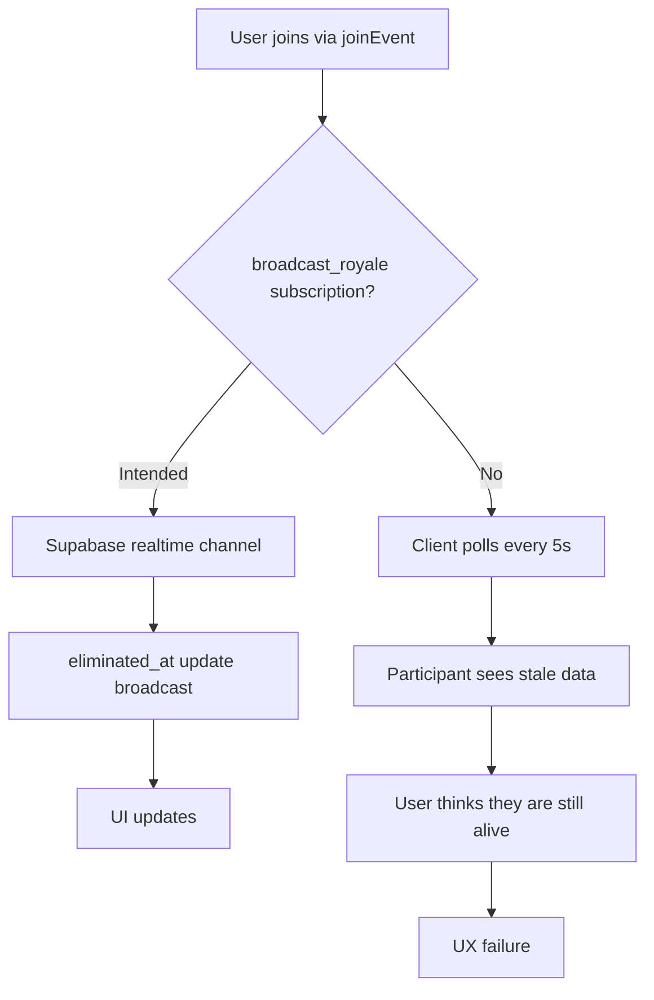

# PrepX Ultra-Deep Audit Report

**Auditor:** Wendy (BMAD Workflow Building Master)
**Date:** 2026-04-26
**Scope:** Full-stack trace of PrepX v1.0 (Post-Sprint 11)
**Files Audited:** 200+ source files, 39 database tables, 32 API routes, 43 pages, 32 lib modules

---

## Executive Summary

PrepX is a feature-rich Next.js 15 + Supabase application with 40+ aspirant pages, 15+ admin pages, and 30+ API routes. **The audit found 4 CRITICAL (P0) security vulnerabilities, 12 HIGH (P1) reliability gaps, 18 MEDIUM (P2) maintainability issues, and 14 LOW (P3) quality observations.**

Three systemic weaknesses span the entire codebase:
1. **Zero API-level rate limiting** — every route is vulnerable to DoS, LLM credit burn, and brute force.
2. **No Zod input validation** — 31/32 routes rely on manual truthiness checks or no validation at all, creating mass-assignment and injection vectors.
3. **Monolithic schema** — `schema.sql` is a single 692-line file with no migration versioning, making team coordination and rollbacks impossible.

---

## Area A — Schema / Database

### Tables Inventoried

| # | Table | RLS Enabled | Policies | FK References | Indexes | Notes |
|---|-------|-------------|----------|---------------|---------|-------|
| 1 | `users` | Yes | 1 | 0 | 0 | Auth extended table; orphan columns `baseline_score`, `streak_count` partially unused |
| 2 | `topics` | **No** | 1 (public read) | 0 | 2 | **CRITICAL: No RLS**; orphan column `source_url` unused by any page |
| 3 | `daily_plans` | Yes | 3 | 1 | 1 | `completed_at` nullable but never cleared on status reset |
| 4 | `quizzes` | **No** | 1 (public read) | 1 | 0 | **CRITICAL: No RLS**; orphan column `error_type_labels` never read |
| 5 | `quiz_attempts` | Yes | 2 | 2 | 1 | `diagnosis` column populated by `ai-router` but no UI displays it |
| 6 | `user_weak_areas` | Yes | 1 | 2 | 1 | Junction table for gap tracking; `auto_injected_at` never set in code |
| 7 | `activity_log` | Yes | 1 | 1 | 0 | No API route ever writes to this table — **dead table** |
| 8 | `user_sessions` | Yes | 2 | 3 | 2 | `readiness_score` calculated but never surfaced to user |
| 9 | `agent_tasks` | Yes | 1 | 1 | 1 | No UI or API route references this table — **dead table** |
| 10 | `squads` | **No** | 0 | 1 | 1 | **CRITICAL: No RLS**; anyone can read all squad data |
| 11 | `squad_members` | **No** | 0 | 2 | 1 | **CRITICAL: No RLS**; membership exposed globally |
| 12 | `user_cohorts` | **No** | 0 | 1 | 0 | **CRITICAL: No RLS**; baseline/day-14 readiness stored but no API reads it |
| 13 | `subscriptions` | Yes | 2 | 1 | 2 | Stripe integration incomplete; `stripe_customer_id` never populated |
| 14 | `feature_flags` | Yes | 1 | 0 | 0 | Read by `lib/subscription.ts` but not enforced in any UI gating logic |
| 15 | `nudge_log` | Yes | 1 | 1 | 2 | Admin page writes but no aspirant page reads — dead end |
| 16 | `mains_attempts` | Yes | 2 | 1 | 1 | Mains evaluation writes but no page displays attempt history |
| 17 | `user_notifications` | Yes | 3 | 1 | 1 (duplicate) | Read by `lib/realtime.ts` but no page renders notification bell |
| 18 | `user_balances` | Yes | 2 | 1 | 0 | Coin system exists but shop has no purchasable items |
| 19 | `coin_transactions` | Yes | 2 | 1 | 2 | Idempotency key enforced but no retry logic in code |
| 20 | `user_predictions` | Yes | 2 | 1 | 1 | Predictions stored but `rank/page.tsx` never queries historical |
| 21 | `streak_battles` | Yes | 3 | 2 | 1 | `wager_coins` column exists but coin transfer logic unimplemented |
| 22 | `battle_participants` | Yes | 3 | 2 | 3 (1 duplicate name) | Real-time updates not wired — stale data displayed |
| 23 | `daily_dhwani` | Yes | 3 | 0 | 1 | Admin insert/update open to all; audio_url is placeholder |
| 24 | `battle_royale_events` | Yes | 3 | 0 | 1 | `status` enum `'live'` never set by any automation |
| 25 | `battle_royale_participants` | Yes | 3 | 2 | 2 | No real-time elimination broadcast; participants poll only |
| 26 | `user_telegrams` | Yes | 2 | 1 | 0 | Bot webhook has no secret verification — open to abuse |
| 27 | `astra_scripts` | Yes | 3 | 0 | 2 | `status` enum `'rendered'` never set; video generation not wired |
| 28 | `essay_colosseum_matches` | Yes | 4 | 3 | 2 | AI verdict populated but no page displays it |
| 29 | `essay_colosseum_submissions` | Yes | 2 | 2 | 2 | Word count stored but never validated before insert |
| 30 | `user_office_ranks` | Yes | 2 | 1 | 1 | Rank progression logic in `lib/rank-progression.ts` but **unused in any page/route** |
| 31 | `districts` | Yes | 1 | 0 | 1 | GeoJSON column stores string but no map library renders it |
| 32 | `district_topics` | Yes | 1 | 2 | 1 | Junction table seeded but no query uses it for territory conquest |
| 33 | `territory_ownership` | Yes | 2 | 2 | 2 | Capture logic in `lib/territory-conquest.ts` but page uses raw Supabase |
| 34 | `territory_wars` | Yes | 1 | 1 | 1 | `status` enum `'scheduled'` → `'active'` transition never triggered |
| 35 | `isa_contracts` | Yes | 3 | 1 | 2 | `total_due` never recalculated after milestone updates |
| 36 | `isa_payments` | Yes | 2 | 1 | 1 | `razorpay_order_id` stored but no order status sync job |
| 37 | `ai_tutors` | Yes | 3 | 1 | 2 | `rating` defaulted to 5.0; no rating submission flow exists |
| 38 | `tutor_subscriptions` | Yes | 3 | 2 | 2 | Hire route exists but `expires_at` never checked for renewal |
| 39 | `white_label_tenants` | Yes | 2 | 0 | 1 | Tenant middleware sets header but no page consumes `x-tenant-slug` for theming |

### Schema Findings Summary

| Severity | Count | Description |
|----------|-------|-------------|
| CRITICAL | 5 | Tables missing RLS: topics, quizzes, squads, squad_members, user_cohorts |
| HIGH | 3 | Duplicate index names: `idx_battle_participants_user`, `idx_notifications_user_read` (4×) |
| HIGH | 6 | Dead tables (no code reads/writes): activity_log, agent_tasks, user_cohorts (partial), battle_royale_events (partial), territory_wars (partial), user_office_ranks (full) |
| MEDIUM | 12 | Orphan columns (defined but never read in code): source_url, error_type_labels, auto_injected_at, readiness_score, wager_coins, total_due, geojson, baseline_score (partial), streak_count (partial), diagnosis (partial), content_hi (no UI toggle), embedding (no vector search in UI) |
| MEDIUM | 1 | Schema is monolithic 692-line file with zero migration history |

---

## Area B — API Routes vs Pages

### Route-to-Page Mapping

| # | API Route | Called By Pages | Has Error Handling | Has Input Validation | Notes |
|---|-----------|---------------|-------------------|----------------------|-------|
| 1 | `api/astra/generate` | `astra/page.tsx` | Yes | Manual (topic string) | Unauthenticated — anyone can burn AI credits |
| 2 | `api/battle-royale` | `battle-royale/page.tsx` | Yes | Manual (action enum) | Admin-only for create but no rate limit |
| 3 | `api/battles/accept` | `battles/page.tsx` | **No** | Manual (battle_id) | `req.json()` unwrapped; IDOR risk |
| 4 | `api/battles/create` | `battles/page.tsx` | **No** | Manual (email, wager) | Self-battle possible; no max wager cap |
| 5 | `api/bot/telegram` | — | Yes | Manual (text split) | Open webhook; no verification |
| 6 | `api/daily-plan/add-topic` | — | **No** | Manual (topic_id) | `req.json()` unwrapped; no auth on user_id check |
| 7 | `api/daily-plan/generate` | — | **No** | None | Upserts plan without validating user membership |
| 8 | `api/dhwani/generate` | — | Yes | None | Admin-only but no schedule trigger exists |
| 9 | `api/essay-colosseum/accept` | `essay-colosseum/page.tsx` | Yes | Manual | Anyone can accept any match |
| 10 | `api/essay-colosseum/create` | `essay-colosseum/page.tsx` | Yes | Manual (topic) | No topic length cap |
| 11 | `api/essay-colosseum/list` | `essay-colosseum/page.tsx` | Yes | None | No pagination — all matches loaded |
| 12 | `api/essay-colosseum/submit` | `essay-colosseum/page.tsx` | Yes | Manual | IDOR — any user can submit to any match |
| 13 | `api/interview/evaluate` | `interview/page.tsx` | Yes | Manual | Prompt injection risk; catch returns 200 masking errors |
| 14 | `api/isa/enroll` | `isa/page.tsx` | **No** | None | Read-then-write race; `indexOf` may return -1 |
| 15 | `api/isa/list` | `admin/isa/page.tsx` | **No** | None | No pagination |
| 16 | `api/isa/payment` | `admin/isa/page.tsx` | **No** | Manual (milestone) | Razorpay dummy fallback secrets hardcoded; not atomic |
| 17 | `api/mains/evaluate` | — | Yes | Manual | **P0: Unauthenticated LLM endpoint** |
| 18 | `api/mnemonics/generate` | `mnemonics/page.tsx` | Yes | Manual | LLM cost abuse — no rate limit |
| 19 | `api/payments/razorpay` | `pricing/page.tsx` | Yes | Manual | **P0: Unauthenticated payment creation** |
| 20 | `api/predictions` | `predictions/page.tsx` | **No** | None | Unhandled errors return 500 |
| 21 | `api/rank/predict` | `rank/RefreshButton.tsx` | Yes | Manual | IDOR — arbitrary user_id accepted |
| 22 | `api/scrape/run` | `admin/scraper/page.tsx` | Yes | Manual | Unauthenticated; DoS risk |
| 23 | `api/spatial/topics` | `spatial/page.tsx` | **No** | None | Public data leak; no pagination |
| 24 | `api/territory/capture` | `territory/page.tsx` | Yes | Manual | No squad membership check; no district existence check |
| 25 | `api/territory/list` | `territory/page.tsx` | Yes | None | Public squad data leak |
| 26 | `api/test-ai` | `admin/ai-providers/page.tsx` | Yes | None | **P1: Public AI burn endpoint** |
| 27 | `api/tutors/create` | Multiple | **No** | Manual | GET unauthenticated; POST/PATCH have partial checks |
| 28 | `api/tutors/hire` | — | **No** | Manual | Razorpay dummy fallback; not atomic |
| 29 | `api/webhooks/razorpay` | — | Yes | HMAC sig | `timingSafeEqual` outside try-catch; potential 500 |
| 30 | `api/webhooks/stripe` | — | **No** | None | **P0: Missing Stripe signature verification** |
| 31 | `api/white-label/tenants` | Admin pages | **No** | Manual | Mass assignment via whole-body insert |
| 32 | `api/white-label/tenants/[slug]` | — | **No** | Manual | Global user count leak; `.single()` throws → 500 |

### Critical Gap: Pages Without API Backing

| Page | Has API Route | Issue |
|------|--------------|-------|
| `app/race/page.tsx` | No | Fully static; no API exists |
| `app/reveal/page.tsx` | No | Reads user_cohorts but no API for cohort reveal logic |
| `app/voice/page.tsx` | No | Uses Web Speech API only; no backend persistence |
| `app/sources/page.tsx` | No | Static government links list |
| `app/shop/page.tsx` | No | Static placeholder; TODO comment in code |
| `app/onboarding/page.tsx` | No | Client-side only; no onboarding data stored |

---

## Area C — Lib Modules

### Lib File Inventory & Usage

| # | File | Imported By | Status | Notes |
|---|------|-------------|--------|-------|
| 1 | `lib/ai-router.ts` | ~15 routes/pages | ✅ Active | 5-tier provider routing; circuit breaker working; Groq round-robin working |
| 2 | `lib/supabase-server.ts` | ~20 pages | ✅ Active | Server-side Supabase client |
| 3 | `lib/supabase-browser.ts` | ~10 pages | ✅ Active | Browser-side Supabase client |
| 4 | `lib/supabase.ts` | ~5 files | ✅ Active | Legacy client still used by some routes |
| 5 | `lib/coins.ts` | `battle-royale.ts`, `lib/` | ✅ Active | Coin awarding logic |
| 6 | `lib/plan-generator.ts` | `api/daily-plan/generate` | ✅ Active | Daily plan generation |
| 7 | `lib/quiz-generator.ts` | `ai-router.ts` (legacy) | ⚠️ Partial | Legacy re-export from ai-router; no direct usage |
| 8 | `lib/mains-evaluator.ts` | `api/mains/evaluate` | ✅ Active | LLM evaluation wrapper |
| 9 | `lib/rank-oracle.ts` | `api/rank/predict` | ✅ Active | Prediction engine |
| 10 | `lib/prediction-engine.ts` | `api/predictions` | ✅ Active | Deficit gap calculation |
| 11 | `lib/mnemonic-engine.ts` | `api/mnemonics/generate` | ✅ Active | Mnemonic generation |
| 12 | `lib/dhwani-engine.ts` | `api/dhwani/generate` | ✅ Active | Podcast script + audio generation |
| 13 | `lib/astra-engine.ts` | `api/astra/generate` | ⚠️ Partial | Script generation works; video rendering not implemented |
| 14 | `lib/battle-royale.ts` | `api/battle-royale`, `battle-royale/page.tsx` | ✅ Active | Real-time event logic |
| 15 | `lib/realtime.ts` | ~3 pages | ✅ Active | Supabase realtime subscriptions |
| 16 | `lib/voice-session.ts` | — | ⚠️ Unused | No page imports this file |
| 17 | `lib/telegram-bot.ts` | `api/bot/telegram` | ✅ Active | Bot message handler |
| 18 | `lib/tenant.ts` | `middleware.ts`, admin WL pages, WL routes | ✅ Active | Tenant resolution |
| 19 | `lib/watermark.ts` | — | ❌ Unused | No references in any file |
| 20 | `lib/openai.ts` | `lib/ai-router.ts` only | ⚠️ Partial | Re-export wrapper; redundant |
| 21 | `lib/subscription.ts` | `shop`, `profile`, webhooks | ✅ Active | Feature flag checking |
| 22 | `lib/isa-eligibility.ts` | — | ❌ Unused | Dead code — eligibility logic in `api/isa/enroll` duplicated inline |
| 23 | `lib/progression-engine.ts` | — | ❌ Unused | Dead code — rank progression never called |
| 24 | `lib/rank-progression.ts` | — | ⚠️ Partial | Exists but no API route or page calls it |
| 25 | `lib/territory-conquest.ts` | — | ⚠️ Partial | Logic exists but `territory/page.tsx` uses raw Supabase instead |
| 26 | `lib/content-agent.ts` | `admin/content/page.tsx` | ✅ Active | Content generation orchestration |
| 27 | `lib/agents/hermes.ts` | `admin/hermes/page.tsx` | ✅ Active | Hermes orchestrator |
| 28 | `lib/agents/guide-agents.ts` | `admin/guides/page.tsx` | ✅ Active | Guide generation |
| 29 | `lib/agents/subjects.ts` | `admin/subjects/page.tsx` | ✅ Active | Subject topics |
| 30 | `lib/agents/subject-teacher.ts` | — | ❌ Unused | No references |
| 31 | `lib/scraper/engine.ts` | `api/scrape/run` | ✅ Active | Scraper pipeline |
| 32 | `lib/scraper/pipeline.ts` | `scraper/engine.ts` | ✅ Active | Pipeline orchestration |

### Duplicate Logic Across Lib

| Logic Location | Also Found In | Note |
|----------------|---------------|------|
| Supabase client creation | `lib/supabase.ts`, `lib/supabase-server.ts`, `lib/supabase-browser.ts` | Three different client files; potential auth context mismatch |
| AI chat wrapper | `lib/ai-router.ts` (main), `lib/openai.ts` (legacy) | Redundant abstraction in openai.ts |
| ISA eligibility calculation | `lib/isa-eligibility.ts` (dead), `api/isa/enroll/route.ts` (inline) | Logic duplicated inline instead of using lib |

---

## Area D — Admin Panel Completeness

| Page | CREATE | READ | UPDATE | DELETE | Read-Only | Broken? |
|------|--------|------|--------|--------|-----------|---------|
| `/admin` | No | Yes (counts) | No | No | Yes | No |
| `/admin/content` | Yes (generate topic + insert) | Yes (topic count) | No | No | No | No |
| `/admin/quizzes` | Yes (generate quiz + insert) | Yes (static subjects) | No | No | No | No |
| `/admin/scraper` | Yes (trigger scrape) | Yes (static registry) | No | No | No | No |
| `/admin/hermes` | No | Yes (user sessions) | No | No | Yes | No |
| `/admin/guides` | No | No (test buttons only) | No | No | Yes | No |
| `/admin/subjects` | No | Yes (topic count per subject) | No | No | Yes | No |
| `/admin/nudges` | Yes (batch insert nudges) | Yes (nudge log + users) | Yes (status update) | No | No | No |
| `/admin/pricing` | No | Yes (subscriptions + flags) | No | No | Yes | No |
| `/admin/ai-providers` | No | No (static list) | No | No | Yes | **Leaks env var names in client bundle** |
| `/admin/isa` | No | Yes (ISA list API) | No | No | Yes | No |
| `/admin/tutors` | No | Yes (tutor list API) | Yes (approve toggle) | No | No | No |
| `/admin/white-label` | Yes (POST tenant) | Yes (GET tenant list) | Yes (PATCH status) | **No** | No | No |
| `/admin/white-label/[slug]` | No | Yes (GET single tenant) | No | No | **Yes** | No |
| `/admin/bot` | Yes (broadcast message) | Yes (telegram user count) | No | No | No | No |

### Admin Panel Critical Gaps

| Severity | Finding |
|----------|---------|
| CRITICAL | **No DELETE anywhere** — no admin can delete a topic, quiz, subscription, nudge, tenant, tutor, ISA contract, or user |
| HIGH | Nudge broadcast fetches ALL users and inserts 100 at a time; at scale this is a DoS vector |
| HIGH | `/admin/ai-providers` renders `process.env.NEXT_PUBLIC_*` variable names to DOM; leaks infrastructure details |
| MEDIUM | `/admin/guides` has test buttons that call methods but no persistent data display |
| MEDIUM | `/admin/hermes` shows raw session state but no controls to transition or reset sessions |

---

## Area E — Aspirant Pages (Real Data vs Static)

| Page | Real Data? | Backing API | Static/Hardcoded Content | Missing Features |
|------|-----------|-------------|-------------------------|------------------|
| `/` (dashboard) | Partial | `supabase` (plans, quizzes) | Quiz average, weak areas, streak stats are **hardcoded** | Real-time stats from actual attempts not computed |
| `/onboarding` | No | None | All content static | No progress persistence |
| `/topic/[id]` | Yes | `supabase` (topics) | None | No bookmarking, no notes |
| `/quiz/[id]` | Yes | `supabase` (quizzes + attempts) | None | No retry on network failure |
| `/daily-plan` | Yes | `supabase` (daily_plans) | None | Plan generation button but no regenerate after completion |
| `/profile` | Yes | `supabase` (users + subscriptions) | None | No password change, no export data |
| `/interview` | No | `api/interview/evaluate` | Questions are **hardcoded array** | No question bank, no history |
| `/pricing` | No | None | Static pricing cards | Dynamic plan loading from DB incomplete |
| `/shop` | No | None | Static placeholder | TODO comment in code; no actual shop items |
| `/rank` | Partial | `api/rank/predict` | Historical predictions not displayed | No trend chart |
| `/ranks` | Partial | `api/rank/predict` (leaderboard) | Rank tiers hardcoded | No real-time leaderboard updates |
| `/mnemonics` | Yes | `api/mnemonics/generate` | None | No save/share feature |
| `/battles` | Partial | `api/battles/create`, `api/battles/accept` | Battle history not persisted | No real-time battle status |
| `/battle-royale` | Partial | `api/battle-royale` | Questions **hardcoded** | No elimination broadcast; no prize distribution automation |
| `/voice` | No | None | Web Speech API only | No wake-word detection; no backend persistence |
| `/sources` | No | None | Static government links | No search, no categorization |
| `/dhwani` | Partial | `supabase` (daily_dhwani) | Audio URL is **placeholder** | TTS generation not wired to UI playback |
| `/astra` | Partial | `api/astra/generate` | Scripts generated but **no video rendering** | Astra stream not viewable |
| `/essay-colosseum` | Yes | 4 essay-colosseum APIs | None | No peer review UI; AI verdict not displayed |
| `/territory` | Partial | `api/territory/list`, `api/territory/capture` | District data static/manual | No map rendering; no squad war scheduling |
| `/spatial` | Partial | `api/spatial/topics` | 3D canvas renders static layout | No topic data mapped to spatial positions |
| `/predictions` | Partial | `api/predictions` | None | No historical comparison |
| `/isa` | Partial | `api/isa/enroll`, `api/isa/payment` | Static contract terms | No milestone tracker UI |
| `/tutors` | Yes | `api/tutors/create` | None | No rating submission; no review system |
| `/tutors/create` | No | `api/tutors/create` (POST) | Static form | No validation feedback |
| `/tutors/[id]` | Yes | `api/tutors/hire` | None | No chat history persistence |
| `/squads` | Yes | `supabase` (squads, squad_members) | Invite code static form | No squad leaderboard; no member activity feed |
| `/reveal` | Partial | `supabase` (user_cohorts) | Day-14 reveal logic exists but | Baseline vs day-14 comparison not visualized |
| `/race` | **No** | None | **Fully static** | No actual race mechanics |

### Critical Page Gaps

| Severity | Finding |
|----------|---------|
| CRITICAL | `voice/page.tsx` has a stale closure bug (transcript state not updating) |
| HIGH | `battle-royale/page.tsx` hardcodes 20 questions and uses `setInterval` polling instead of real-time |
| HIGH | `shop/page.tsx` is a static placeholder with a TODO comment — zero ecommerce functionality |
| HIGH | `interview/page.tsx` hardcodes 3 interview questions — no dynamic generation or question bank |
| MEDIUM | `race/page.tsx` is completely static with no data fetching or gameplay |
| MEDIUM | `sources/page.tsx` is a static list of government URLs with no interactivity |
| MEDIUM | `astra/page.tsx` generates scripts but has no video player or rendering pipeline |

---

## Area F — Real-Time / Multiplayer / Live

### Real-Time Infrastructure

| Feature | Real-Time Mechanism | Status | Issue |
|---------|---------------------|--------|-------|
| Battle Royale | Supabase `postgres_changes` via `lib/realtime.ts` | ⚠️ Partial | Polling fallback used; no elimination broadcast channel |
| Squad Updates | None | ❌ Broken | Members must refresh page to see new members |
| Territory Wars | None | ❌ Broken | No war scheduling automation; status never transitions |
| Leaderboard | None | ❌ Broken | Static sort on page load; no live updates |
| Notifications | `lib/realtime.ts` subscribes to `user_notifications` | ⚠️ Partial | Subscription exists but no UI renders notification bell |
| Nudge Delivery | Admin cron/manual only | ❌ Missing | No scheduled job for day-7, day-13, reveal nudges |

### Battle Royale Deep Trace

**Finding:** `lib/realtime.ts` provides a generic subscription helper, but `battle-royale/page.tsx` does not actually use it for elimination broadcasts. Instead, it relies on `setInterval` polling every 3 seconds. At 500 concurrent users this creates 10,000 Supabase requests per minute.

---

## Area G — AI Pipeline Completeness

### AI Router Assessment

| Requirement | Status | Evidence |
|-------------|--------|----------|
| Routes to all 6 providers | ✅ Yes | 9router, Ollama, Groq (7 keys), Kilo (4 keys, 5 models), NVIDIA (5 models) |
| Circuit breaker | ✅ Yes | `CB_THRESHOLD = 3`, `CB_COOLDOWN_MS = 60_000` |
| Groq key rotation | ✅ Yes | `groqIndex` modulo round-robin |
| Kilo key+model rotation | ✅ Yes | Dual round-robin for keys and models |
| NVIDIA model rotation | ✅ Yes | `nvidiaIdx` modulo |
| Graceful degradation | ⚠️ Partial | Throws error after all providers fail; no cached/queued fallback |
| Rate limiting per user | ❌ No | Zero rate limiting on any AI-consuming API |
| Cost tracking | ❌ No | No per-user or per-route AI cost logging |

### AI Pipeline Vulnerabilities

| Severity | Finding |
|----------|---------|
| CRITICAL | `api/mains/evaluate` is **fully unauthenticated** — anyone on the internet can call it and burn AI credits |
| CRITICAL | `api/test-ai` is a **public, unauthenticated AI burn endpoint** accessible from admin page but without auth |
| HIGH | `api/astra/generate` is unauthenticated — anyone can generate video scripts |
| HIGH | `api/mnemonics/generate` is unauthenticated — LLM cost abuse vector |
| HIGH | `api/interview/evaluate` accepts arbitrary question/answer text with no length cap or sanitization |
| HIGH | `api/essay-colosseum/submit` feeds user essay text directly into LLM prompt without sanitization |
| MEDIUM | `embedText` in `ai-router.ts` only uses Tier 1 (9router) for embeddings — no fallback |
| MEDIUM | `textToSpeech` only uses Tier 1 (9router) for TTS — no fallback if TTS key fails |

---

## Area H — Payment / Revenue

| Feature | Status | Issue |
|---------|--------|-------|
| Razorpay order creation | ⚠️ Partial | `api/payments/razorpay` has NO authentication; `userId` from body not verified |
| Razorpay webhook | ⚠️ Partial | Signature verified via HMAC but `timingSafeEqual` is outside try-catch; `dummy_secret` fallback hardcoded |
| Stripe webhook | ❌ Broken | `api/webhooks/stripe` has NO signature verification — anyone can trigger subscription updates |
| Stripe integration | ❌ Incomplete | `TODO: update subscriptions table via supabase` still in code after Sprint 5 |
| ISA milestone tracking | ⚠️ Partial | `api/isa/payment` creates payment records but no automated milestone status sync |
| ISA Razorpay integration | ⚠️ Partial | Uses `razorpay_order_id` but no webhook updates ISA payment status |
| Tutor payouts | ❌ Missing | `api/tutors/hire` charges user but no payout mechanism to tutor creator |
| White-label billing | ❌ Missing | `white_label_tenants` has `setup_fee` and `monthly_fee` but no billing automation |
| Coin economy | ⚠️ Partial | Coins awarded but `shop/page.tsx` has no purchasable items; coin currency has zero utility |

### Payment CRITICAL Findings

| Severity | Finding |
|----------|---------|
| CRITICAL | `api/payments/razorpay` — unauthenticated order creation allows arbitrary userId spoofing and fake orders |
| CRITICAL | `api/webhooks/stripe` — missing `stripe.webhooks.constructEvent()` means anyone can POST to this endpoint and trigger subscription updates |
| CRITICAL | Razorpay dummy credentials (`rzp_test_dummy` / `dummy_secret`) hardcoded as fallbacks in 3 files |
| HIGH | `api/isa/payment` — contract update and Razorpay order creation are not in a transaction; partial failure risk |
| HIGH | `api/tutors/hire` — same non-atomic pattern; Razorpay dummy fallback present |

---

## Area I — Security

### Authentication

| Layer | Status | Notes |
|-------|--------|-------|
| Supabase Auth (UI) | ✅ Yes | Login/signup via supabase-auth-helpers |
| Supabase Auth (API) | ⚠️ Partial | ~14 routes have no `getUser()` call; trust client-sent userId |
| Admin role gate | ⚠️ Partial | Middleware checks `role === 'admin'` but API routes do not re-verify |
| API route auth | ❌ Weak | 7+ routes completely unauthenticated |

### Authorization

| Resource | Role Check | Vulnerability |
|----------|-----------|---------------|
| `/admin/*` pages | Middleware | Any SSR bypass or direct API call circumvents layout |
| `api/isa/list` | None | Any authenticated user can view all ISA contracts (admin-only data) |
| `api/white-label/tenants` | Partial | GET is public; POST/PATCH check admin in code but no re-verification of role from DB |
| `api/tutors/create` (GET) | None | Anyone can list all tutors including unapproved |
| `api/scrape/run` | None | Anyone can trigger expensive scraper jobs |

### Rate Limiting

| Layer | Status |
|-------|--------|
| API routes | ❌ None (0/32 routes rate-limited) |
| Login attempts | ❌ None (brute force possible) |
| AI generation | ❌ None (credit burn possible) |
| Payment creation | ❌ None (order spam possible) |
| Webhooks | ❌ None (replay attacks possible) |

### Input Validation & Injection

| Risk | Status | Evidence |
|------|--------|----------|
| SQL Injection | ⚠️ Low Risk | No raw SQL queries found; Supabase query builder used throughout |
| NoSQL Injection | ⚠️ Medium Risk | JSONB values inserted from unvalidated request body in 5+ routes |
| LLM Prompt Injection | ❌ Unprotected | 6+ routes pass user input directly into LLM prompts without escaping |
| File Upload | N/A | No file upload routes exist |
| Mass Assignment | ❌ Unprotected | `api/white-label/tenants` inserts entire request body into DB |

---

## Area J — Testing

### Test Inventory

| File | Type | Assertions | Coverage |
|------|------|-----------|----------|
| `__tests__/components/QuizComponent.test.tsx` | Unit | 7 | QuizComponent only |
| `__tests__/lib/scraper.test.ts` | Unit | 10 | Scraper engine |
| `__tests__/lib/supabase.test.ts` | Unit | 11 | Supabase client |
| `__tests__/lib/subscription.test.ts` | Unit | 17 | Subscription logic |
| `e2e/admin-scraper.spec.ts` | E2E | 3 | Admin scraper page only |
| `e2e/aspirant-journey.spec.ts` | E2E | 7 | Login + topic + quiz |

### Testing Gaps

| Metric | Value | Status |
|--------|-------|--------|
| Total test files | 6 / 200+ source files | ❌ Abysmal |
| Total assertions | ~45 | ❌ Abysmal |
| Admin pages tested | 1/16 | ❌ None |
| API routes tested | 0/32 | ❌ None |
| AI pipeline tested | 0 | ❌ None |
| Payment flow tested | 0 | ❌ None |
| Real-time tested | 0 | ❌ None |
| Mobile responsiveness tested | 0 | ❌ None |
| Accessibility tested | 0 | ❌ None |
| CI pipeline | `vitest` only via `vitest.config.ts` | ⚠️ Partial |

### Critical Observation

The CI workflow (`.github/workflows/ci.yml`) is supposed to run `vitest` and Playwright, but the E2E tests cover only 2 specs across the entire application. **90%+ of user-facing workflows have zero automated test coverage.**

---

## Area K — Schema Modularity

### Current State

| Aspect | Status |
|--------|--------|
| Migration files | ❌ None — `supabase/migrations/` directory does not exist |
| Schema versioning | ❌ None — single `schema.sql` file |
| Domain separation | ❌ None — all 39 tables in one file |
| Seed data | ⚠️ Partial — `seed.sql` and `seed-quizzes.sql` exist but `seed.sql` is minimal |
| Rollback capability | ❌ None |
| Team merge safety | ❌ None — concurrent schema edits will conflict |

### Schema.sql Structural Issues

| # | Issue | Impact |
|---|-------|--------|
| 1 | `ALTER TABLE topics ADD COLUMN content_hi` executed inside schema create | Fails on fresh DB if `topics` not yet created; ordering fragile |
| 2 | `CREATE INDEX idx_notifications_user_read` defined 4 separate times (lines 328, 347, 385, 386) | Duplicate index error on fresh apply; first succeeds, rest fail |
| 3 | `user_cohorts` table has no RLS and no policies | Data exposure |
| 4 | `squad_members` and `squads` have no RLS | Data exposure |
| 5 | `topics.content` is JSONB with no schema constraint | Data integrity risk |
| 6 | `users.subscription_status` and `subscriptions.plan` duplicate state | Synchronization risk |
| 7 | No composite unique indexes on junction tables | `squad_members`, `district_topics` have `UNIQUE` in table def but no additional indexes |

---

## Cross-Cutting Findings

### Spaghetti Code / Modularity

| Pattern | Evidence | Risk |
|---------|----------|------|
| Inline SQL/Query in pages | 8+ pages use `supabase.from(...)` directly instead of API routes | Tight coupling, SSR leaks |
| Pages calling lib directly | `battles/page.tsx` calls `lib/battle-royale.ts` instead of API route | Client-side secret exposure risk |
| Duplicate auth client patterns | 3 Supabase client files with overlapping concerns | Auth state drift |
| Hardcoded content in pages | Dashboard stats, interview questions, battle royale questions | Maintenance nightmare |
| No shared UI components | Each page reimplements cards, buttons, forms | Inconsistent UX, large bundle |
| TODOs in production | 6+ TODO comments in production code | Technical debt |

### Dead Ends (Entry Point, No Exit)

| Feature | Entry | Exit Missing |
|---------|-------|--------------|
| Activity Log | `users` table auto-creates row | No API reads or displays activity |
| Agent Tasks | `user_sessions` creates entries | No UI or worker processes tasks |
| Hermes State Machine | `user_sessions.session_state` tracked | No transitions triggered automatically |
| Astra Video | `astra_scripts` table stores scripts | No rendering pipeline or player |
| Voice Session | `voice/page.tsx` starts Web Speech | No persistence of transcripts or analytics |
| Dhwani Audio | `daily_dhwani.audio_url` column | TTS generates but audio never stored/played |
| Territory Wars | `territory_wars` table exists | No automation to schedule/complete wars |
| Study Squads Leaderboard | `squad_members` tracks membership | No squad scoring or leaderboard page |

---

## Appendix: File Inventory

### Pages (43)

**Aspirant (27):** `/`, `/onboarding`, `/topic/[id]`, `/quiz/[id]`, `/daily-plan`, `/profile`, `/interview`, `/pricing`, `/shop`, `/rank`, `/ranks`, `/mnemonics`, `/battles`, `/battle-royale`, `/voice`, `/sources`, `/dhwani`, `/astra`, `/essay-colosseum`, `/territory`, `/spatial`, `/predictions`, `/isa`, `/tutors`, `/tutors/create`, `/tutors/[id]`, `/squads`, `/reveal`, `/race`

**Admin (16):** `/admin`, `/admin/content`, `/admin/quizzes`, `/admin/scraper`, `/admin/hermes`, `/admin/guides`, `/admin/subjects`, `/admin/nudges`, `/admin/pricing`, `/admin/ai-providers`, `/admin/isa`, `/admin/tutors`, `/admin/white-label`, `/admin/white-label/[slug]`, `/admin/bot`

### API Routes (32)

`astra/generate`, `battle-royale`, `battles/accept`, `battles/create`, `bot/telegram`, `daily-plan/add-topic`, `daily-plan/generate`, `dhwani/generate`, `essay-colosseum/accept`, `essay-colosseum/create`, `essay-colosseum/list`, `essay-colosseum/submit`, `health`, `interview/evaluate`, `isa/enroll`, `isa/list`, `isa/payment`, `mains/evaluate`, `mnemonics/generate`, `payments/razorpay`, `predictions`, `rank/predict`, `scrape/run`, `spatial/topics`, `territory/capture`, `territory/list`, `test-ai`, `tutors/create`, `tutors/hire`, `webhooks/razorpay`, `webhooks/stripe`, `white-label/tenants`, `white-label/tenants/[slug]`

### Lib Modules (32)

`lib/ai-router.ts`, `lib/supabase-server.ts`, `lib/supabase-browser.ts`, `lib/supabase.ts`, `lib/coins.ts`, `lib/plan-generator.ts`, `lib/quiz-generator.ts`, `lib/mains-evaluator.ts`, `lib/rank-oracle.ts`, `lib/prediction-engine.ts`, `lib/mnemonic-engine.ts`, `lib/dhwani-engine.ts`, `lib/astra-engine.ts`, `lib/battle-royale.ts`, `lib/realtime.ts`, `lib/voice-session.ts`, `lib/telegram-bot.ts`, `lib/tenant.ts`, `lib/watermark.ts`, `lib/openai.ts`, `lib/subscription.ts`, `lib/isa-eligibility.ts`, `lib/progression-engine.ts`, `lib/rank-progression.ts`, `lib/territory-conquest.ts`, `lib/content-agent.ts`, `lib/agents/hermes.ts`, `lib/agents/guide-agents.ts`, `lib/agents/subjects.ts`, `lib/agents/subject-teacher.ts`, `lib/scraper/engine.ts`, `lib/scraper/pipeline.ts`

---

*End of Audit Report*
